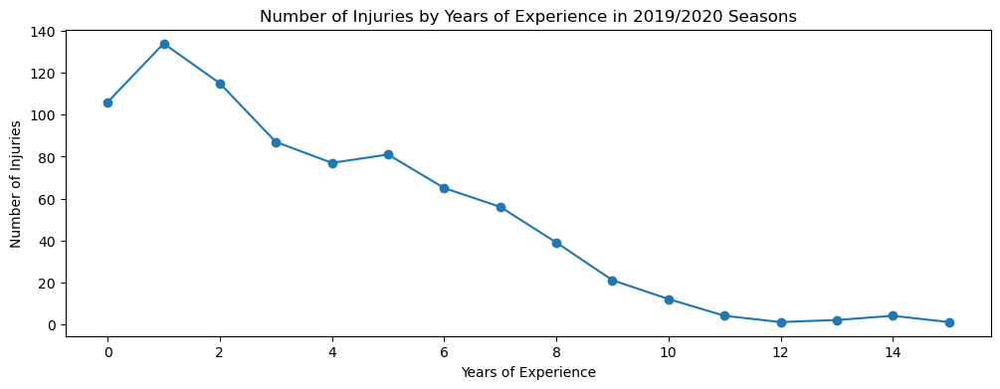
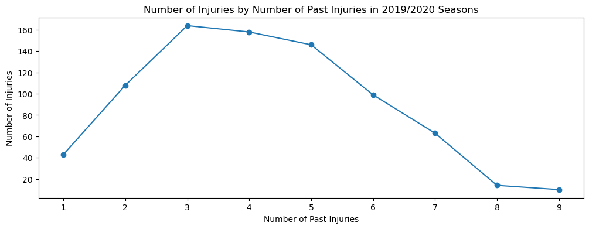
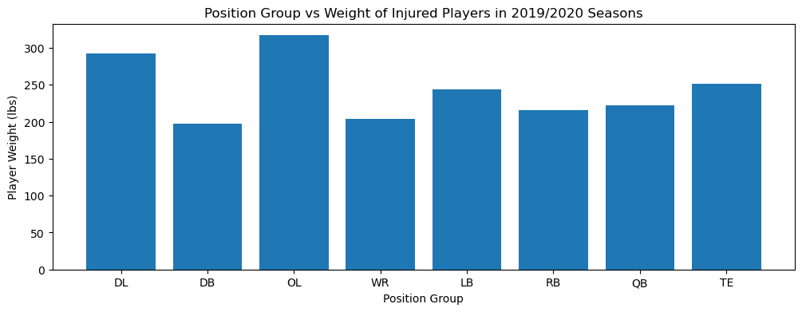
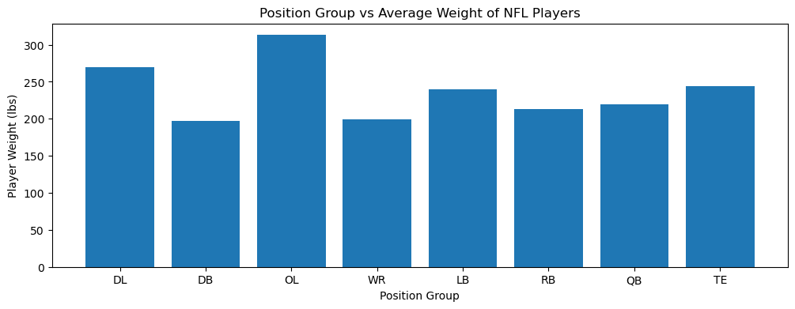
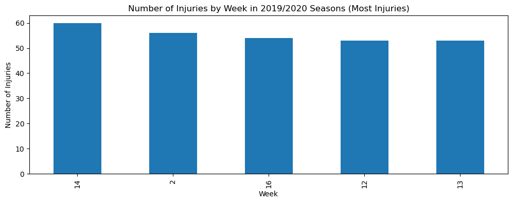
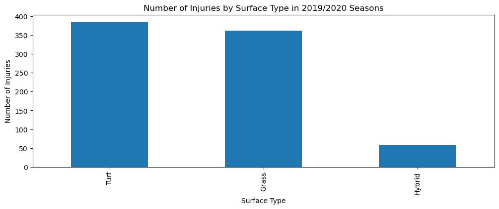
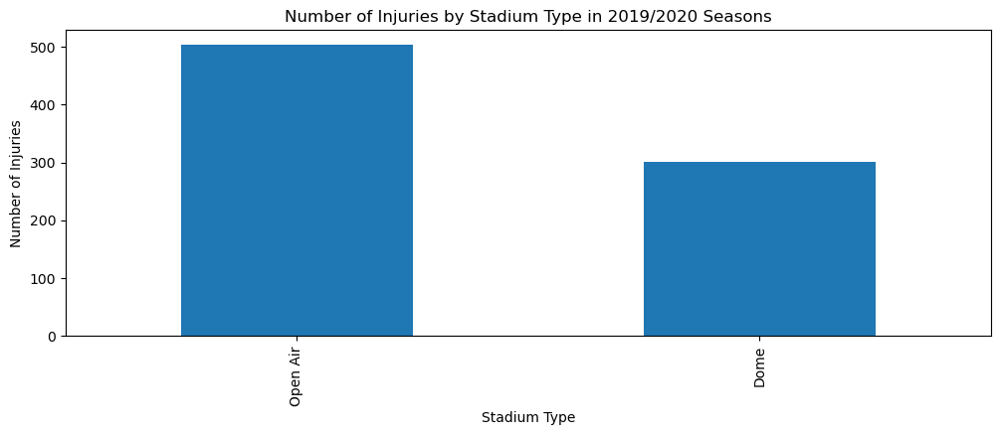

# Analysis of Injuries in the 2019/2020 NFL Seasons
## Introduction 

Have you ever watched your favorite NFL team play on Sunday and found yourself increasingly frustrated at the amount of injuries that occurred? You may have blamed the strength and conditioning staff or even the team’s general manager for picking injury prone players. As a Buffalo Bills fan, I know I definitely have had these thoughts before, which is the exact reason why I decided to take a look at what’s actually affecting injury rate throughout the NFL. 

The most injured teams in the NFL during the 2019/2020 seasons included the Philadelphia Eagles, Buffalo Bills and New Orleans Saints, while the least injured teams included the Los Angeles Rams, Los Vegas Raiders and Pittsburgh Steelers. The most injured players in the 2019/2020 seasons included Za’Darius Smith, Jabrill Peppers and Andrus Peat. 

## Years of Experience

One of the most popular frustrations fans have with their respective teams is keeping around old players. There’s speculation that the older the player, the more injury prone they become. But this does not seem to be necessarily true. A part of this trend could come from older players knowing and understanding how to take care of their bodies more. The longer players have been around the league, the more information and coaching they go through to prevent injuries. Other reasons may include older players not playing with as much speed and force as their younger selves and ultimately not playing as much as teams shift to younger talent. 

## Past Injuries

 

Another frustration is keeping around players with many past injuries. Now while it may be true that when one or two injuries occur, they are more likely to have another one, but after that, it is not the case. This trend could be caused by a better understanding of how to take care of their bodies after having a past injury as well. Another could be that in these two seasons specifically, those one or two injuries could have been season ending, not allowing the players to have the opportunity to injure themselves again.

## Weight

I have also heard many comments made about a player's weight being a factor in injury rate. Whether it be a player being too big or too small for their relative position group, but I found that it wasn’t much of a factor at all. Even when a player is the perfect weight for their position group, they can still get injured, which is shown by each position group’s average weight vs. their injury weight being nearly identical. It may be the case that a player's weight may affect their playing ability, but it is not the case that it affects injury rate. So be careful complaining about a player being too small or big when they’re injured. 

## Injuries by Week

There’s also been a lot of controversy in recent years about the length of the NFL season. Some have been advocates of extending the season for more games and more action, while others are more wary of putting player’s bodies under more duress. But even though you may think that injuries start piling up in the later weeks of the season, the data shows that it’s actually more random than that and injuries can happen in any week. There is no outlier week where more injuries tend to happen, and since the amount of injuries that occured in the top five weeks were nearly identical, making the season longer or shorter would not affect the amount of injuries that occur.

## Playing Surface

One of the more overarching reasons why fans think more injuries occur more and more these days is the type of playing surface teams are installing on their fields. There has been a trend of installing more turf fields in both the NFL and other professional sports organizations due to its ease of maintenance and weather resistance. But many fans and players have caused outrage over this and have pushed for more grass fields. For the players, there seems to be a comfort factor of playing on grass which may be the reason for the push. But the data shows that the amount of injuries that occur are relatively the same across both grass and turf fields. 

## Stadium Type

However, the only true possibility I found was whether the stadium was a dome or open air. It was clear that open air stadiums are more likely to cause injuries compared to domed stadiums. But some NFL teams like the Buffalo Bills are heavy advocates of their stadium being open aired due to the weather condition factor of Buffalo football games. The snow makes for a tough environment to play in for other teams, which is highly advantageous for the Bills. So even though open air stadiums are more dangerous, some teams may neglect that standard for other reasons. 

## Conclusion

Overall, injuries in the NFL are a lot more random than you think. But there may be other factors that could better explain the “injury bug” that many teams throughout the league face. Companies like WHOOP think that the best way to prevent injury in sports is to master recovery through understanding physiological data. However, getting access to that data is very hard for members of the public because of HIPAA laws. But ultimately the level of consistency it takes for athletes to master their bodies is nearly impossible to achieve, especially in a highly physical sport like football. So next time a player on your favorite team gets injured, think twice before complaining about the field, player or organization’s staff.
